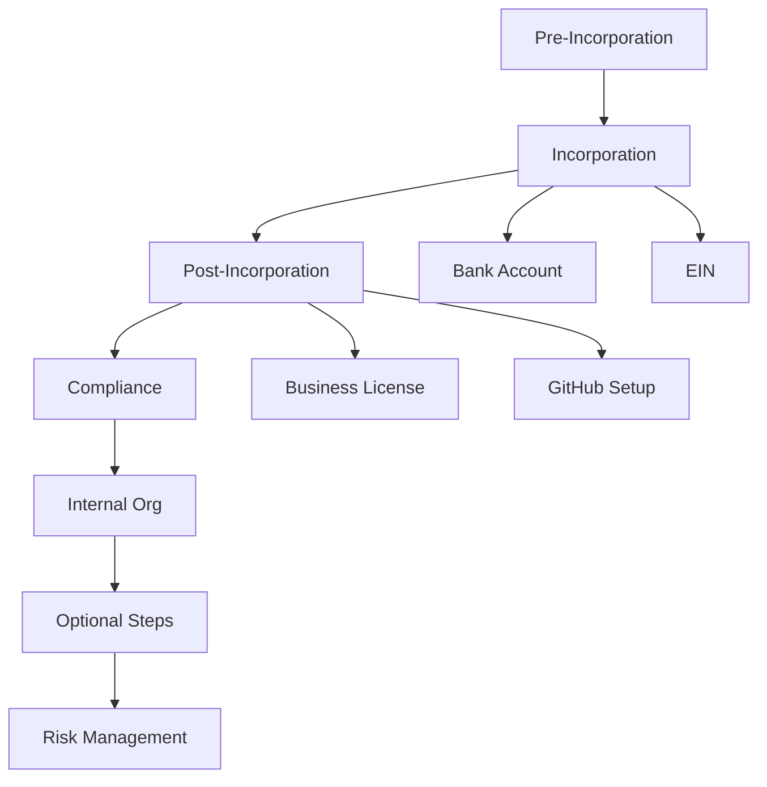

# Progress Tracking

## Overall Progress
- [ ] Pre-Incorporation Planning (0%)
- [ ] Incorporation Filing (0%)
- [ ] Post-Incorporation Setup (0%)
- [ ] Compliance & Licensing (0%)
- [ ] Internal Organization (0%)
- [ ] Optional Early Steps (0%)
- [ ] Risk Management (0%)

## Estimated Timeline
| Section | Start Date | Target Completion | Status |
|---------|------------|-------------------|--------|
| Pre-Incorporation | TBD | TBD + 4 weeks | Not Started |
| Incorporation | TBD + 4 weeks | TBD + 7 weeks | Not Started |
| Post-Incorporation | TBD + 7 weeks | TBD + 11 weeks | Not Started |
| Compliance | TBD + 11 weeks | TBD + 13 weeks | Not Started |
| Internal Org | TBD + 13 weeks | TBD + 15 weeks | Not Started |
| Optional Steps | TBD + 15 weeks | TBD + 17 weeks | Not Started |
| Risk Management | TBD + 17 weeks | TBD + 19 weeks | Not Started |

## Critical Path Items
1. Company Name Finalization
2. Incorporation Filing
3. EIN Obtainment
4. Bank Account Setup
5. Business License Acquisition

## Dependencies Map

## Budget Tracking
| Item | Estimated Cost | Actual Cost | Status |
|------|---------------|-------------|--------|
| Incorporation Filing | $90 | - | Pending |
| Registered Agent | $100-200/year | - | Pending |
| Business License | $75 | - | Pending |
| Insurance | $500-1000/year | - | Pending |
| Software Tools | $200-500/month | - | Pending |

## Notes
- Update this file regularly as progress is made
- Mark items as complete when finished
- Adjust timelines as needed
- Track actual costs vs. estimates 